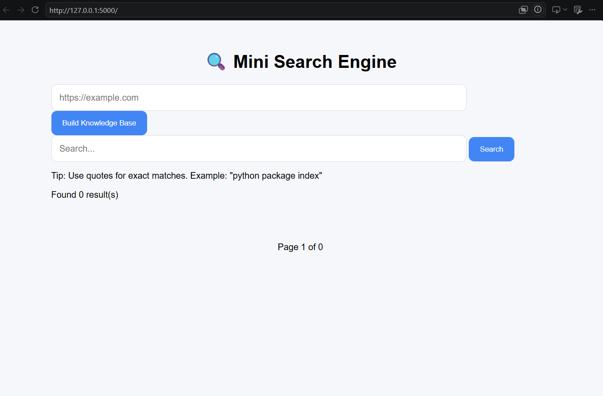
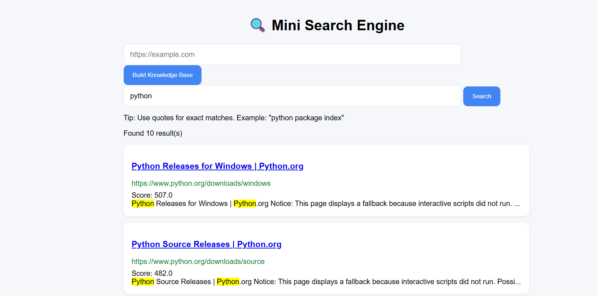
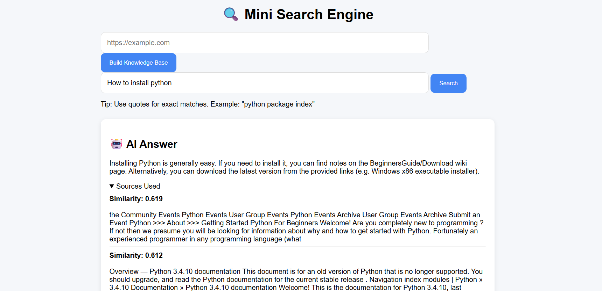

# 🚀 Website RAG Platform

An AI-powered **Retrieval-Augmented Generation (RAG)** platform that transforms any website into a searchable knowledge base.

The platform crawls websites, indexes their content, performs keyword and semantic search, and generates grounded AI answers using Large Language Models (LLMs).

---

# ✨ Key Features

## 🌐 Intelligent Web Crawling

- Multithreaded crawler
- Domain-restricted crawling
- URL normalization
- Internal link discovery
- Crawl graph visualization

## 🔍 Search Engine

- TF-IDF Ranking
- Exact phrase search
- Autocomplete suggestions
- Search analytics
- Pagination

## 🤖 AI Question Answering

- Semantic Search using embeddings
- Vector Similarity Search
- Retrieval-Augmented Generation (RAG)
- Groq LLM integration
- Source-aware responses

## 📚 Knowledge Base Generation

- Crawl any documentation website
- Automatic text chunking
- Embedding generation
- Dynamic indexing
- Reusable knowledge bases

## 🐳 Deployment

- Docker support
- Docker Compose
- Easy local setup

---

# 🏗️ System Architecture

```text
                  User
                    │
                    ▼
            Flask Web Interface
                    │
      ┌─────────────┴─────────────┐
      │                           │
      ▼                           ▼
 TF-IDF Search Engine         RAG Pipeline
      │                           │
      ▼                           ▼
 SQLite Database      Sentence Transformers
                                  │
                                  ▼
                          Vector Similarity Search
                                  │
                                  ▼
                              Groq LLM
                                  │
                                  ▼
                             AI Response
```

---

# ⚙️ Tech Stack

| Category | Technologies |
|----------|--------------|
| Backend | Python, Flask |
| Database | SQLite |
| Search | TF-IDF, Inverted Index |
| AI | Sentence Transformers, Groq API |
| Crawling | BeautifulSoup, Requests |
| Deployment | Docker, Docker Compose |
| Version Control | Git, GitHub |

---

# 📁 Project Structure

```text
website-rag-platform/
│
├── assets/
│   ├── home.png
│   ├── links.png
│   ├── RAG.png
│   └── auto complete.png
│
├── crawler/
├── frontend/
├── indexer/
├── rag/
├── search/
├── database/
├── data/
├── Dockerfile
├── docker-compose.yml
├── requirements.txt
└── README.md
```

---

# 📸 Screenshots

## 🏠 Home Page

<p align="center">
  
</p>

---

## 🔍 Search Results

<p align="center">
  
</p>

---

## 🤖 AI Answer

<p align="center">
  
</p>

---

## ✨ Autocomplete Suggestions

<p align="center">
  
</p>

---

# 🚀 Getting Started

## Clone Repository

```bash
git clone https://github.com/devanupriyj-code/website-rag-platform.git

cd website-rag-platform
```

## Create Environment Variables

Create a `.env` file.

```env
GROQ_API_KEY=your_groq_api_key
```

---

## Run Using Docker

```bash
docker compose up --build
```

Visit:

```
http://localhost:5000
```

---

## Local Development

Install dependencies

```bash
pip install -r requirements.txt
```

Run the application

```bash
python -m frontend.app
```

---

# 🔄 How It Works

### 1️⃣ Crawl Website

The crawler visits website pages, extracts text and links, and stores them in SQLite.

↓

### 2️⃣ Build Search Index

The indexer creates a TF-IDF inverted index for fast keyword searching.

↓

### 3️⃣ Generate Embeddings

Website content is chunked and converted into dense vector embeddings using Sentence Transformers.

↓

### 4️⃣ Retrieve Relevant Context

The system performs:

- Keyword Search (TF-IDF)
- Semantic Search (Vector Similarity)

↓

### 5️⃣ Generate AI Answer

Relevant chunks are retrieved and passed to the Groq LLM to generate grounded, context-aware responses.

---

# 🌟 Highlights

- ✅ Built a search engine completely from scratch
- ✅ Multithreaded web crawler
- ✅ Dynamic website indexing
- ✅ Semantic search with embeddings
- ✅ Retrieval-Augmented Generation (RAG)
- ✅ Dockerized deployment
- ✅ Modular architecture
- ✅ Supports crawling any documentation website

---

# 🚀 Future Improvements

- BM25 Ranking
- Redis Caching
- PostgreSQL Support
- Multiple Knowledge Bases
- Authentication
- Citation Links
- Dark Mode
- Incremental Crawling
- Hybrid Search (TF-IDF + Semantic)

---

# 📊 Why This Project?

Traditional search engines return relevant documents.

This platform goes one step further by retrieving the most relevant information and using **Retrieval-Augmented Generation (RAG)** to generate accurate, grounded, and explainable answers while reducing hallucinations.

---

# 👨‍💻 Author

## Devanupriy Jain

**First-Year B.Tech Computer Science Engineering Student**

Interested in:

- 🔍 Search Systems
- 🤖 Artificial Intelligence
- ⚙️ Backend Development
- 📚 Information Retrieval
- 🌍 Open Source

---

⭐ **If you found this project useful, consider giving it a star!**